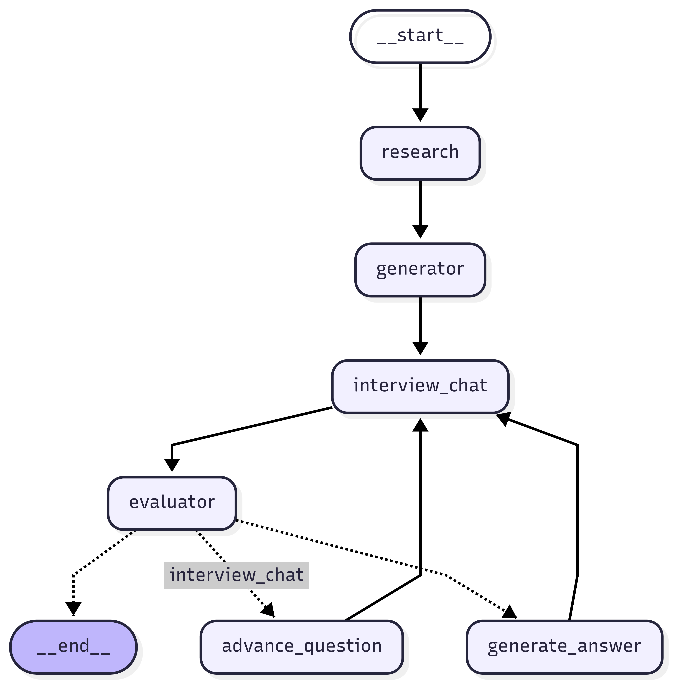

# Interview Preparation Chatbot

An interview preparation tool that conducts technical interviews, evaluates responses, and provides personalized feedback using AI. Built with LangGraph for orchestrating complex workflows and powered by Groq's fast inference API.

## What is AI Interview Bot?

AI Interview Bot is an automated interview system that:
- Researches job roles using web search to understand current market requirements
- Generates relevant technical questions tailored to specific roles
- Conducts interactive interviews with real-time user input
- Provides detailed evaluations with scores and constructive feedback
- Generates ideal answers when requested for learning purposes

Perfect for job seekers looking to practice interviews, improve their responses, and gain confidence before real interviews.

## Workflow Architecture

The system follows a structured workflow orchestrated by LangGraph:

<!-- Mermaid Graph Placeholder - Replace with actual graph image -->


**Workflow Steps:**
1. **Research Node** - Gathers comprehensive job role context using Tavily search
2. **Generator Node** - Creates 5 tailored interview questions based on research
3. **Interview Chat** - Conducts interactive Q&A session with the user
4. **Evaluator Node** - Analyzes responses and provides structured feedback
5. **Generate Answer Node** - Creates ideal responses when requested
6. **Decision Logic** - Routes between questions, evaluations, and ideal answers

## Tech Stack

### Core Framework
- **LangGraph** - Workflow orchestration and state management
- **LangChain** - LLM integration and prompt engineering
- **Pydantic** - Data validation and structured outputs

### AI Models & APIs
- **Groq API** - Fast inference for text generation
  - Generator: `openai/gpt-oss-120b`
  - Evaluator: `Gemma2-9b-It`
- **Tavily Search API** - Real-time web research for job context

### Python Libraries
- `langgraph` - State graph workflow management
- `langchain-groq` - Groq LLM integration
- `langchain-community` - Additional LangChain tools
- `tavily-python` - Web search client
- `python-dotenv` - Environment variable management
- `pydantic` - Data modeling and validation

## Setup Instructions

### 1. Create Virtual Environment

```bash
# Create virtual environment
python -m venv ai-interview-env

# Activate virtual environment
# On Windows:
ai-interview-env\Scripts\activate
# On macOS/Linux:
source ai-interview-env/bin/activate
```

### 2. Install Dependencies

```bash
pip install -r requirements.txt
```

Create a `requirements.txt` file with:
```txt
langgraph>=0.0.40
langchain-groq>=0.1.0
langchain-community>=0.0.20
langchain-core>=0.1.0
tavily-python>=0.3.0
python-dotenv>=1.0.0
pydantic>=2.0.0
```

### 3. Environment Configuration

Create a `.env` file in the project root:

```env
# Groq API Configuration
GROQ_API_KEY=your_groq_api_key_here

# Tavily Search API Configuration  
TAVILY_API_KEY=your_tavily_api_key_here
```

### 4. API Setup

#### Groq API Setup
1. Visit [Groq Console](https://console.groq.com/)
2. Sign up for a free account
3. Navigate to API Keys section
4. Generate a new API key
5. Copy the key to your `.env` file

**Note:** Groq offers generous free tier with fast inference speeds, perfect for this project.

#### Tavily Search API Setup
1. Visit [Tavily](https://tavily.com/)
2. Create an account
3. Go to your dashboard
4. Generate an API key
5. Copy the key to your `.env` file

**Note:** Tavily provides real-time web search capabilities optimized for AI applications.

### 5. Run the Application

```bash
python main.py
```

## Usage Example

```python
from your_module import build_graph

# Initialize the interview system
app = build_graph()

# Set up initial state
init_state = {
    "job_role": "Data Scientist",  # Specify target role
    "job_role_context": "",
    "generated_qas": [],
    "evaluation_feedback": [],
    "current_q_index": 0,
    "wants_ideal": False,
    "ideal_answers": [],
    "num_steps": 0,
    "max_iterations": 10,
}

# Start the interview
final_state = app.invoke(init_state)
```

## Future Scope of Improvements

### 🖥️ User Interface
- **Web Interface**: Build a React/Streamlit frontend for better user experience
- **Mobile App**: Cross-platform mobile application for interview practice on-the-go
- **Voice Integration**: Add speech-to-text and text-to-speech for realistic interview simulation
- **Progress Dashboard**: Visual analytics showing improvement over time

### 💾 Data Persistence
- **Database Integration**: 
  - PostgreSQL/MongoDB for storing user profiles, interview history, and performance metrics
  - User authentication and session management
  - Historical performance tracking and analytics
- **Cloud Storage**: Store interview recordings and transcripts
- **Resume Analysis**: Parse and analyze uploaded resumes for personalized question generation

### 🌊 Streaming Features
- **Real-time Response Generation**: 
  - Implement streaming responses for better user experience
  - Token-by-token generation display
  - Partial response processing
- **Live Feedback**: Real-time hints and suggestions during interviews
- **Adaptive Questioning**: Dynamic question difficulty based on performance

### 📊 Monitoring & Observability
- **LangSmith Integration**:
  - Trace and debug LLM calls
  - Performance monitoring and optimization
  - A/B testing for prompt variations
  - Usage analytics and cost tracking
- **Logging & Metrics**: Comprehensive application monitoring
- **Error Tracking**: Automated error detection and reporting

### 🚀 Advanced Features
- **Multi-modal Support**: 
  - Video interview simulation with facial expression analysis
  - Whiteboard coding challenges with real-time code execution
- **AI Interviewer Personalities**: Different interviewer styles (friendly, tough, technical)
- **Industry Specialization**: Specialized question banks for different domains
- **Team Interviews**: Multi-participant interview simulations
- **Interview Scheduling**: Calendar integration for practice sessions

### 🔧 Technical Improvements
- **Microservices Architecture**: Scalable, containerized deployment
- **API Gateway**: RESTful API for third-party integrations
- **Caching Layer**: Redis for improved performance
- **Background Jobs**: Celery for async processing
- **Testing Suite**: Comprehensive unit and integration tests

## Contributing

1. Fork the repository
2. Create a feature branch (`git checkout -b feature/new-feature`)
3. Commit your changes (`git commit -am 'Add new feature'`)
4. Push to the branch (`git push origin feature/new-feature`)
5. Create a Pull Request

## License

This project is licensed under the MIT License - see the [LICENSE](LICENSE) file for details.

## Support

For issues, questions, or contributions, please open an issue on GitHub or contact the development team.

## Connect on 

Linkedin - https://linkedin.com/in/singhsrj

---

**Happy Interviewing! 🎯**